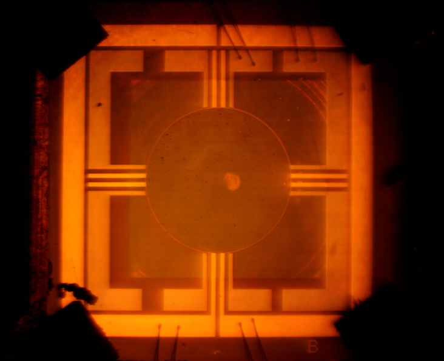
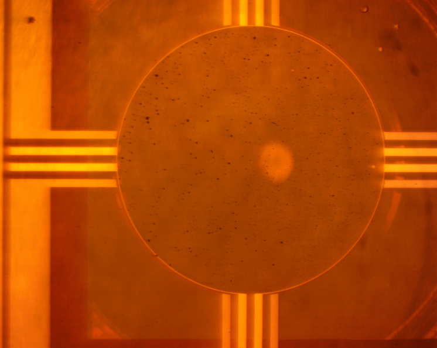
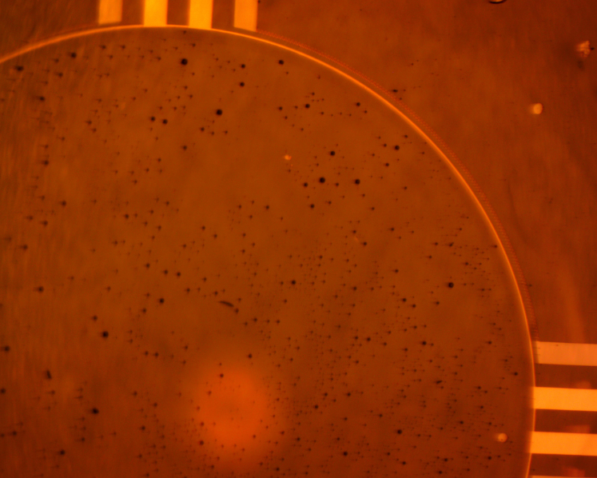
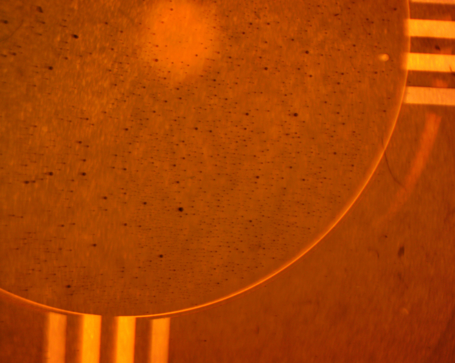
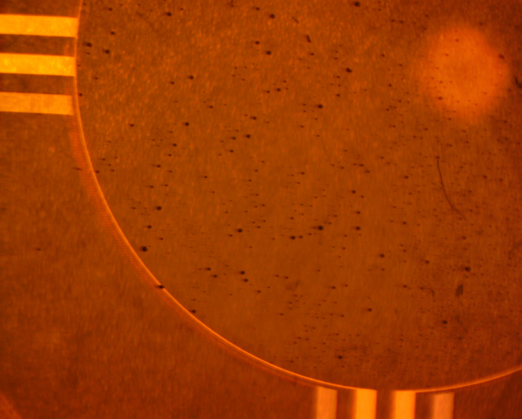
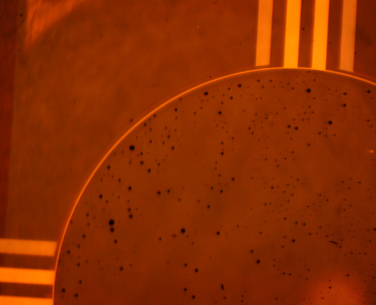

# Introduction

## Description

Metal: Nb

Wafer #: 20

Wafer Material:  

Chip: 29  

Device: 03 Meander

Absorber: 3mm Au

## Notes

## Device Photographs

# Log of Work

| Cooldown Date  | Purpose of Cooldown | Configuration | Vessel | Note |
| -------------- | ------------------- | ------------- | ------ | ---- |
| [[2021-04-21]] | Initial Test        | Dark          | WTC    |      |
|                |                     |               |        |      |
|                |                     |               |        |      |
|                |                     |               |        |      |
|                |                     |               |        |      |
|                |                     |               |        |      |

# Configuration Details

Filter order wrt incoming light

| Cooldown Date          | OVC      | 1st Stage                        | 2nd Stage        | Cone Details | Cone Filter | Summary |
|------------------------|----------|----------------------------------|------------------|--------------|-------------|---------|
| [2017-07-21 Fri 11:32] | 1mm HDPE | C12(0.09) M24869 + 110umPPP 20mm | C15T N19944 16mm | Dark         | Dark        |         |
| [2017-08-23 Wed 11:25] | 1mm HDPE | C12(0.09) M24869 + 110umPPP 20mm | C15T N19944 16mm | 4.5          | 20THz       |         |
|                        |          |                                  |                  |              |             |         |
|                        |          |                                  |                  |              |             |         |
|                        |          |                                  |                  |              |             |         |
|                        |          |                                  |                  |              |             |         |

# Measurements

## Resistance Measurements Using AVS47
   
All measurements with AVS47 use 100uV excitation and lowest possible range unless otherwise stated 

*Heater* 

| Cooldown Date  | R_300K | R_77K | R_10K  | R_4.2K | R_1.8K | Vessel |
| -------------- | ------ | ----- | ------ | ------ | ------ | ------ |
| [[2021-04-21]] | 436.0  | 204.2 | 140.47 |        |        | WTC    |
| [[2021-04-29]] | 436.1  | 204.4 |        |        |        | WTC    |

*Device*

| Cooldown Date  | R_300K | R_77K | R_10K | R_4.2K | R_1.8 | Vessel |
| -------------- | ------ | ----- | ----- | ------ | ----- | ------ |
| [[2021-04-21]] | 2939.0 |       | 830.3 |        |       | WTC    |
| [[2021-04-29]] | 2938.9 |       |       |        |       | WTC    |

# To Be Converted (all below is garbage)

** Noise 

#+ATTR_LATEX: :align ||p{16cm}||
#+CAPTION: Amplifier parameters used for noise measurements
|-----------------------------------------------------------------------------------------------------|
| *Chip Heater Bias Circuit Parameters*: R1=1960; R2=100; R3=26.1; Rhtr=(as measured each cooldown Ohms) |
| *TES Bias Circuit Parameters*: R1=1000; R2=181; R2=10021                                              |
| *Output offset*: (as noted each day, around -7.5V)                                                    |
| *TES Gain*: 601                                                                                       |
| *Heater AC Gain*: (104x DC)                                                                           |
|                                                                                                     |
| _Using TESTAMP1A_                                                                                     |
|-----------------------------------------------------------------------------------------------------|

|--------------------------------------------------------------------------------------------------------|
| *Chip Heater Bias Circuit Parameters*: R1=1800; R2=51; R3=21.0; Rhtr=(as measured each cooldown 167Ohms) |
| *TES Bias Circuit Parameters*: R1=1000; R2=182; R2=10021                                                 |
| *Output offset*:4.1779 (as noted each day, around -V)                                                    |
| *TES Gain*: 601                                                                                          |
| *Heater AC Gain*: (104x DC)                                                                              |
|                                                                                                        |
| _Using Squaring Amp_                                                                                     |
|--------------------------------------------------------------------------------------------------------|

                                 
[2017-08-23 Wed 11:29] output offset = -7.58183V; Rh=31.14Ohms

                                         
#+ATTR_LATEX: :align c c c c c c c p{16mm}
#+CAPTION: Measured Data
|------------------------+------+----------+--------------+---------+---------+-------------------+---------------+---------------+-------+---------+--------+-----------+----------------------------------------------|
| Date                   | Load | V_{Bias} | V_{setpoint} | R_{TES} | V_{DCH} | Chip Heater Power | 80Hz DC Noise | 80Hz AC Noise | 850um | 80um    | Vessel | 3dB point | Comments                                     |
|                        |      |        V |            V |    Ohms |       V |                uW |       pW/rtHz |       pW/rtHz | pWrms | nWrms   |        | (by hand) |                                              |
|------------------------+------+----------+--------------+---------+---------+-------------------+---------------+---------------+-------+---------+--------+-----------+----------------------------------------------|
| [2017-08-23 Wed 11:29] | 300K |    4.213 |     -7.34897 |    22.3 | 6.22279 |           91.2509 |            10 |               |       |         | WTC    |           | TestAmp1A. 1/f                               |
| [2017-08-24 Thu 11:29] | 300K |     8.01 |     -7.19515 |    19.5 | 6.20552 |           90.7446 |             7 |           5.0 |       |         | WTC    |      1200 | TestAmp1A. scitec speed taken here (~1.3kHz) |
| [2017-08-23 Wed 14:27] | 300K |    10.03 |     -7.10701 |    19.1 | 6.20425 |           90.7118 |             5 |           4.5 |       |         | WTC    |      1200 | TestAmp1A.                                   |
| [2017-08-23 Wed 14:45] | 300K |    11.78 |     -6.96926 |    21.0 | 6.20525 |           90.7389 |           4.8 |           3.3 |       |         | WTC    |      1200 | TestAmp1A.                                   |
| [2017-08-23 Wed 14:56] | 300K |    4.008 |     -7.36626 |    21.8 |  6.2278 |            91.405 |            11 |          11.2 |       |         | WTC    |      1350 | TestAmp1A.1/f - unstable < 100Hz             |
| [2017-08-23 Wed 15:08] | 300K |    0.941 |     -7.53038 |    22.0 |  6.2305 |             91.49 |            40 |            40 |       |         | WTC    |      1500 | TestAmp1A.1/f                                |
| [2017-08-23 Wed 15:18] | 300K |    11.06 |     -7.02825 |    20.2 | 6.20115 |            90.651 |             5 |           3.5 |       |         | WTC    |      1200 | TestAmp1A.                                   |
| [2017-08-23 Wed 15:23] | 300K |    11.06 |     -7.28075 |    11.0 | 6.18204 |            90.062 |           6.5 |           6.5 |       |         | WTC    |      1200 | TestAmp1A.                                   |
| [2017-08-23 Wed 15:30] | 300K |    11.06 |     -6.10661 |    53.9 | 6.28153 |            92.988 |             6 |           2.5 |       |         | WTC    |      1200 | TestAmp1A.                                   |
| [2017-08-23 Wed 15:36] | 300K |    11.06 |     -4.84975 |   100.0 | 6.35636 |            95.211 |             6 |           2.6 |       |         | WTC    |      1200 | TestAmp1A.                                   |
| [2017-08-23 Wed 15:45] | 300K |    11.06 |      2.74413 |   383.5 | 6.57483 |            101.87 |             6 |           3.0 |       |         | WTC    |      1000 | TestAmp1A.                                   |
| [2017-08-23 Wed 15:54] | 300K |    11.06 |     -6.08107 |   54.85 | 6.28197 |            92.990 |             6 |           2.5 | 4e-12 | 2.5e-9` |        |           |                                              |
|                        |      |          |              |         |         |                   |               |               |       |         |        |           |                                              |
|                        |      |          |              |         |         |                   |               |               |       |         |        |           |                                              |

[2017-08-23 Wed 15:44] max R can get using feedback circuit is
397.9Ohms 

[2017-08-23 Wed 16:16] 

|-------+------+----------+--------------+---------+---------+-------------------+---------+-----+---------------+---------------+--------------------------------------------------+------------------------------------------------------|
| Date  | Load | V_{Bias} | V_{setpoint} | R_{TES} | V_{DCH} | Chip Heater Power | V^2_dch | SF  | V^2_ach Noise | V^2_dch Noise | Configuration                                    | Comment                                              |
|       |      | V        | V            | Ohms    | V       | uW                |         | W/V |               |               |                                                  |                                                      |
|-------+------+----------+--------------+---------+---------+-------------------+---------+-----+---------------+---------------+--------------------------------------------------+------------------------------------------------------|
|       |      |          |              |         |         |                   |         |     |               |               |                                                  |                                                      |
|       |      |          |              |         |         |                   |         |     |               |               |                                                  |                                                      |
| 14/07 |      |          |              |         |         |                   |         |     |               |               | PARA AMP 9008.R17=1k // R16=1k. RVS temp circuit | V^2 1.5Vp-p.still - would not pass to PARA like this |
|       |      |          |              |         |         |                   |         |     |               |               |                                                  |                                                      |
#+tblfm: =(*1E-6)/

*Note*: Typical dark V_{DCH} for Nb with V_b 2.0V and R_{TES} ~20Ohms
is ~3.8V which gives ~25uW.

** 1

# Lab Notes

