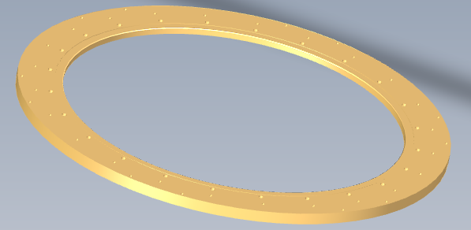
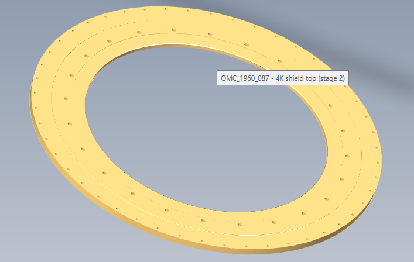
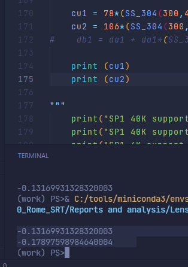

- ## Regular Rome Meeting link
  \>> this is to remind everybody about our telecon QMC-Sapienza on MISTRAL
  
  \>> here: https://uniroma1.zoom.us/j/8531768909
- Admin
  collapsed:: true
	- POs etc...
	  collapsed:: true
		- ### sumitomo order PO 6339
		  collapsed:: true
		  
		  sumitomo oa: ![[216644.pdf]]
		  
		  
		  Account No. Customer Order No. SHI Ref. No. Date www.shicryogenics.com
		  QMC I 6339-1960 v2 216644 03/11/20
		  Stock ID Cust Part No. Product Description Qty Pack Delivery Disct Price Total
		  RP-182B2S Pulse Tube Cryocooler 1 each / / 19,095.00 19,095.00
		  Cold Head Unit + Valve Unit
		  Buffer tank + 1m line
		  F-100H F-100H Compressor Unit 1 each / / 14,155.00 14,155.00
		  RW25ZN1018 FLEXLINE 25AX20M 12F-12F SUPPLY 1 each / / 1,230.00 1,230.00
		  RW25ZN1019 FLEXLINE 25AX20M 12F-12F RETURN 1 each / / 1,230.00 1,230.00
		  RV21ZN0234 Cold Head Cable 20m 1 each / / 369.50 369.50
		  RV21ZN1013 Input Power Cable 5m 1 each / / 741.81 741.81
		  for F-100H (JPN) and F-100H
		  10/TOOL KIT 082B2S Tool Kit for RP- Series including: 1 each / / 399.00 399.00
		  1 Gas Recharging Valve RZ03ZN0074EQ
		  1 Open End Wrench [29mm] SS0029
		  1 Open End Wrench [26mm] JIS B 4630 26N
		  1 Quick Wrench RQ-30N
		  1 Open End Wrench [16mm] CW0016
		  2 Open End Wrench [19mm] SS0019
		  1 Open End Wrench [35mm] SS0035
		  2 Open End Wrench [41mm] SS0041
		  10/NH-118 HOSE NIPPLE 2 each / / 17.00 34.00
		  Always need to purchase 2 (pair)
		  *INCOTERMS-DDP Incoterms: DDP to Cardiff CF24 3AA 1 each / / 3,725.51 3,725.51
		  UK from Japan
		  INCOTERMS 2020 RULES
		  Delivery: 14-16 weeks from receipt of order
		  shipped via AIR FREIGHT
	- chase fridge 6338
- Files
  collapsed:: true
  
  https://drive.google.com/drive/folders/16t64fGmNarAdXFx-VwSkFiVuO5u473fW
- Design
  collapsed:: true
  
  300mK cold finger epoxied in for KID labs
  
  "Get a filter scheme from Carole based on band = 77 to 103 GHz at FWHM."
- Meetings
	- 2021-01-04 with Rome
	- filter discussion, (for detector block)
	  collapsed:: true
		- dont want metal parts too close to detector - use 10mm min to avoid this
			- worry that will affect waveguides etc
		- QMCI to suppply drawings, poss of expanding meat of holder #ToDo
	- general cryostat design mounting discussions inc ribs, etc...
	  
	  next meeting [[2021-01-13]] 11AM 
	  internal meeting [[2021-01-07]] 14:00
	- [[2021-01-07]] internal meeting
	  collapsed:: true
		- still dont know how lenses are mounted, CSW has asked ROME
			- they want to use their own lens mounting scaffolding, with braids, which is horrible
			- T/C want to mount off sides of shields
			- NEED TO HAVE A BIG DISCUSSION ABOUT THIS
		- by mid morning tomorrow, top half of system should be drawings
		- thick thermal [[filters]] can contract by as much as 100um from RT to 4K
			- clamping is complex for big stacks to maintain tightness, incorporate spring
			- need breathing holes, along flat and along
		- fridge straps are tricky
		- cryostat mounting to frame is flawed
			- designed to old design (Gissupe)
				- possibilty of bar to be used, mount on baseplate, possibility of middle ring but not bottom ring
					- rome need to confirm desires
						- want to use carbon fibres
		- fridge legs?
			- 1K over long?
			- 300mk plate is ~93mm above 1K plate, can get to 130 if widen 1k shields
				- kids epoxy straps
				- [x] calculate legs lngth
				- [x] check all leg calculations
				- [x] something elsoe
				- [x] done
				- [x] spec tc
					- [x] pid?
					- [x] 55 pin
					- [x] ultra thermometer
	- [[2021-01-11]] internal meeting
	- meeting with rome [[2021-01-13]]
		- lens positions are as cold
		- giuseppe input
		- want to rotate upper flange by 45 degress for alignment
			- maybe not even there
			- QMCI minor drawing error
		- discussions regarding attaching cryostat to frame
		- want 90 degree on fischer so cant fall out
		- 4k magnetic shield
			- cryoperm
			- 1-2 mm thick
			- outside 4k shield
			- qmci to install
		- gas tanks and remote valve
		  
		  1960 next meeting [[2021-01-15]] 11am - 12.30
	- [[2021-01-24]] internal meeting
		- outstanding issues
		- sidelinks
			- 2nd stage ones ok
			- 1st stage not
				- short length
			- tyrones new design
				- peek/nylon
				- spring by belville washers
				- roller bearing at warm end
				- how can we test these?
					- bucket ring that mounts on inside of ovc?
		- straps / braid
		- same for fridge
	- meeting with rome [[2021-01-28]]
	  
	  tables,
	  technical drawings
	  blueprints,
	  FEM
		- maintanence - sorb pump expulsion? annually?
	- internal design [[2021-02-05]]
		- manufacturing
		  
		  tk can't do it
		  
		  wec - 2 options 
		  
		  1.	single piece
		  	a.	5-7weeks
		  	b.	5-8k for large ovc
		  	c.	other ones 5k per smaller
		  	d.	top hats 2-3k
		  2.	rolling, welding
		  	a.	half the costs
		  	b.	over 10 weeks
		  
		  go for route 1.
		- tweaks to ovc by cw
		  
		  reduce number of parts of top hat structure
		- straps
		  
		  how to curtain?
		- support pins
		  
		  how to test?
		- email from elia
		  
		  1960: respond to elias's email regarding thermometry
	- meeting with rome [[2021-02-10]]
		- output from cdr
		- cdr team want design drawings for security - also, nda will be issued
			- if nda, ok with ken
		- need assembly document / drawing package
			- is that reasonable? ken
			- elia has page 1,2,3 for document
		- ### labview
		- in control room 500m away at ground level
			- use ethernet
			- mildly prefer linux, but not essential
			- executable is preferable
			- [[QMCI/projects/1960/1960]] check if can compile for linux
			- 1960 rashmi electronics check
		- next meeting
	- internal meeting [[2021-02-17]]
	  
	  zoom link:           Join Zoom Meeting  
	  [https://us02web.zoom.us/j/88190201384?pwd=TWhWdTAvYTEzOUQwaHJkL05UTW5ZZz09](https://us02web.zoom.us/j/88190201384?pwd=TWhWdTAvYTEzOUQwaHJkL05UTW5ZZz09)  
	  
	  Meeting ID: 881 9020 1384  
	  Passcode: S76GDq
	- my questions
	  1. quotes ![[1960_QuotationQuestions_2020-02-16]]
	- brian happy with what [[prv]] did for [[sequestim]] 
	  
	  3. anysys simulation
	  4. drawing checks before manufacturing
	  5. tc specs
	  6. frame
	  7. transit/installation plans
	  8. 
	  
	  
	  [[sequestim]] is not cold
		- excess 500mW on 1st stage - Al shield, giving delta T on shield
		- 4K stage is at 5.2K
		- cant cycle fridge
		- find out about MLI in [[sequestim]]
		  
		  why is 1st stage plate aluminium?
	- meeting with rome [[2021-04-28]]
	  
	  25GHz preferable, 20GHz is OK though
	- [[2021-12-02]]
		- ok with RuOx
		- temperature stabilisation
			- 0.5mk per hour
			- however, work to requirements in contract
		- cold position (eb)
			- TODO check cold posn 609mm?
			  SCHEDULED: <2021-12-02 Thu>
		- DONE LNA?
		  SCHEDULED: <2021-12-02 Thu>
			-
			-
		- DONE check TC LV
		  SCHEDULED: <2021-12-02 Thu>
	- [[2021-12-09]]
		- plug
			- TODO rome want 4-way plug
			  SCHEDULED: <2021-12-10 Fri>
			- 30db attenuator at 4K at input
			- 2 amplifier and dc blocks
			- 1dc block at LNA output at 4K
			- 4k shield is ~~350mm
			- TODO check 4K accesability
			  SCHEDULED: <2021-12-10 Fri>
			- attenuator at 1K?
				- disapates heat at 1K
			- shipping 2 x lna now, DC block is incorporated
			-
- Schedule
  collapsed:: true
  
  need to establish, and keep track of what is where:
  
  C:\Users\cox01\QMC Dropbox\1960_Rome_drawings\QMC_1960_Rome_system_TK_parts_current.xlsx
  
  [[1960_ManufacturingMonitoring]]
  [[1960_Schedule]]
- Lens heights
  collapsed:: true
	- [[2021-11-22]] measure distances
		- after a lot of work find they are all ok
		- [1960_LensPositions.xlsx](../../../assets/1960_LensPositions_1638280736677_0.xlsx) this is not live - it is hosted in logseq
	- [[2021-12-01]] elia has also asked for xy contraction of lens holders [[2021-12-02]]
		- lens 1 shelf
			- 
			- od = 370mm
			- id = 292mm
			- crudely approximate this as a 370-292=78mm single point.
			- ==contract 0.13mm==
		- lens 2 shelf
			- 
			  id:: 61a7a46e-2f4d-4861-aec3-5f5a09f8806b
			- od = 350mm
			- id = 244mm
			- 350 - 244 = 106 -
			- ==contract 0.18mm==
	- 