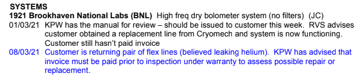

- 10:08 some fucking thing
- 10:15 [[1960_Vactest]] leak check
- 10:50 adam says richard would like me to accompany him on [[2021-10-06]] to visit xander barnes in switzerland
	- same day as lowens hospital appt
	- rome
	- too many reasons to say yes
	- generally get impression richard is keen for me to demonstrate my commitment
		- this may be counter productive
- 11:10 slow leak check - no obvious quick leaks, but slow rise to ~4e-8 leak units
	- 11:20 leave to settle
- 11:42 look at window clamp redsign
- 13:03 re-leak check
- [[af]]
- [[sse]] call
- 15:00 add electrical tape to [[1960_Vactest]] joins
	- what they did on muscat
- 1921 manual
	- 
- #journal nirvana nevermind was released 30 years ago today [[1991-09-24]] which means it's probably 28 years since I sat my GCSEs. I remember that weird yoghurt milkshake idea i got obsessed with