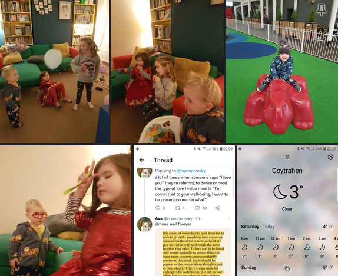

- #journal Maya day in town with Bonnie and Sadie. Lowen and I were meant to go too but the fence had started to come down, so we needed to go to b&q and get another pole instead. Nettie came round around 8am while we Maya was making her pancakes to tell us. Offered to go half on the money. Sade is really hurt by what I've done and how I've behaved and is getting triggered so often by me and what I do. I disgust her and she hates me. If she had independent means or somewhere to go she would have left me by now. I don't know where we go with this. Sadie is on about being separate but living together while we both get some headspace.  Could be a good idea, as I can't shake the feeling that although I know I've done awful things and lied to her and deceived her, she's conflating me with her dad, all men. Me and Lowen got the post up ok although it does lean a bit back. Lovely walking round b&q with him and doing bits in the garden though I did get stressed with him when I thought we were on a time limit. Picked up Maya Sadie and Bonnie from the station at around 5. Sade is currently, at 9.40, trying to get the girls to sleep, but they are pretty pumped. Al and si are coming around tomorrow. Gonna be weird. First social interaction with people who know I drunk drove. 
  
  Bonnies tooth fell out and sade has to do the money for the tooth fairy. Kinda annoyed that Maya's first encounter of the tooth fairy is through Bonnie.
  
   
  
  Sadie's endo is getting bad again. Severe stomach cramping and back pain. Been ramping up this year, periods are more varied in when they can happen. This one was 10 ish days early. Closer to full moon now, but still a massive jump. #endo