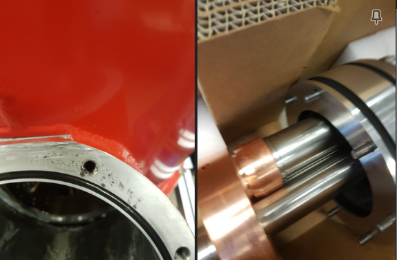

# things to do today
	- [[1788R]] look at amplifier [[2021-11-30]]
	- [[PersonalToDo]] isp
	- ~~seal masters~~
	- [[PersonalToDo]] kids toothbrushes
	- [[1960]] re-leak check
	- ~~[[1960]] recontact entropy~~
	- [[peter-ade]] last day before retirement
	- [[this week]]
- [[1960]] leak testing continues
  collapsed:: true
	- pt head installed / blanking plate on top
		- problem, likely with blanking plate
	- replace blanking plate with top ovc pieces and window blank
		- i think there's a problem with the bottom of the ovc extension or baseplate
			- think it's the ocv extension, that gave a quicker rise to 1e-7 than the baseplate
				- some foil on the oring
				- also, some grease had leaked through the pt head vibrational isolation part
					- 
				- cleaned o-rings, grooves and re-greased
				- use pt head blank
				- use metal window blank
				-
- [[diode calibration]] continues
  collapsed:: true
	- engraved diodes 160 - 172 (inc) and perform n2 dunk
	-
- [test](‪file://../../RVS_Systems.xlsx)
- #journal screwed up overnight. took lowen back to our bed because he wouldnt sleep and he ended up crrawling over to sadie's side and disturbing her. she is understandably upset and explains this selfish behaviour is what she's had to contend with the last 6 years. she's had to deal with a lot of stuff while i go to work, the miscarriage, stomach ulcer, illnesses, endo etc... I have always gone to work if i can, and especially at the start with maya, felt huge pressure being the only source of income. i feel less so now that i'm well ensconced at work, but i still feel pressure to perform for my salary. i do take that too far and end up putting the pressure back on sadie, which isn't ok.
- #sp sadie's bleeding turned into a "normal" period and lasted 5-6 days. really hoping this 2 week cycle becomes regular. there has been an increase in endo pain, period regularity this year. keep an eye on it #endo