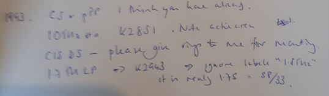
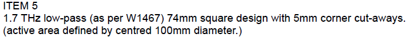

- cryomech
	- fraunhofffer
	- mpg
- lab
	- mpg amp
	- pyro
		- 1855R & 1907R
	- filters
	  collapsed:: true
		- ~~2000 INO~~
			- [[2021-12-09]] 12:00 k2898 10thz 31.7mm dias
		- 1971 SRON
		  collapsed:: true
			- [[2021-12-09]] 12:42: k2994 200 cm hpe
				- 2 x 25.4mm dia CA
				- 1 x 27mm dia CA
				- 13:51 cut ok, but screwed up and cut 4 x 25.4mm. One extra was deliberate, but the other was because i didnt update the program
				- tell carole i screwed up [[1971 SRON]]
				-
		- 1993 SRON
		  collapsed:: true
			- question over square / rings, etc
			- 
			- 
			- 
	- ~~prep shipping~~
		- ~~kvn~~
		- ~~georgia~~
	- epoxy rtds
- ~~rome 10am~~
  collapsed:: true
	- now 2pm
	  SCHEDULED: <2021-12-09 Thu 14:00>
- ~~hd3 for carole~~
- 14:00 [[1960]] rome meeting
- ~~rome straps~~
  collapsed:: true
	- problem with level of 1k plate?
		- no, problem is strap